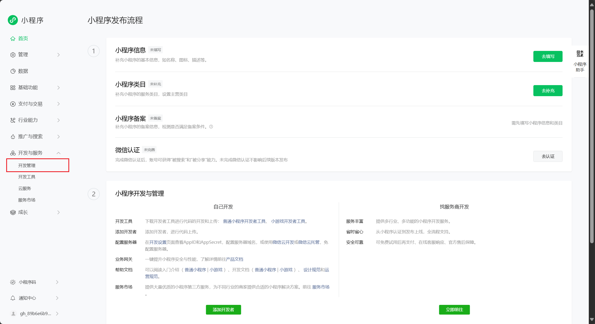
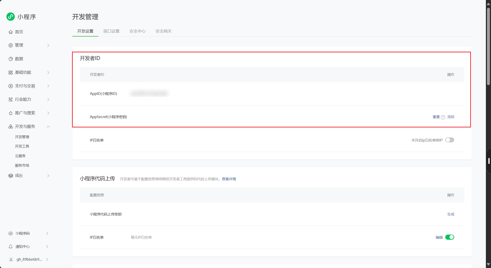
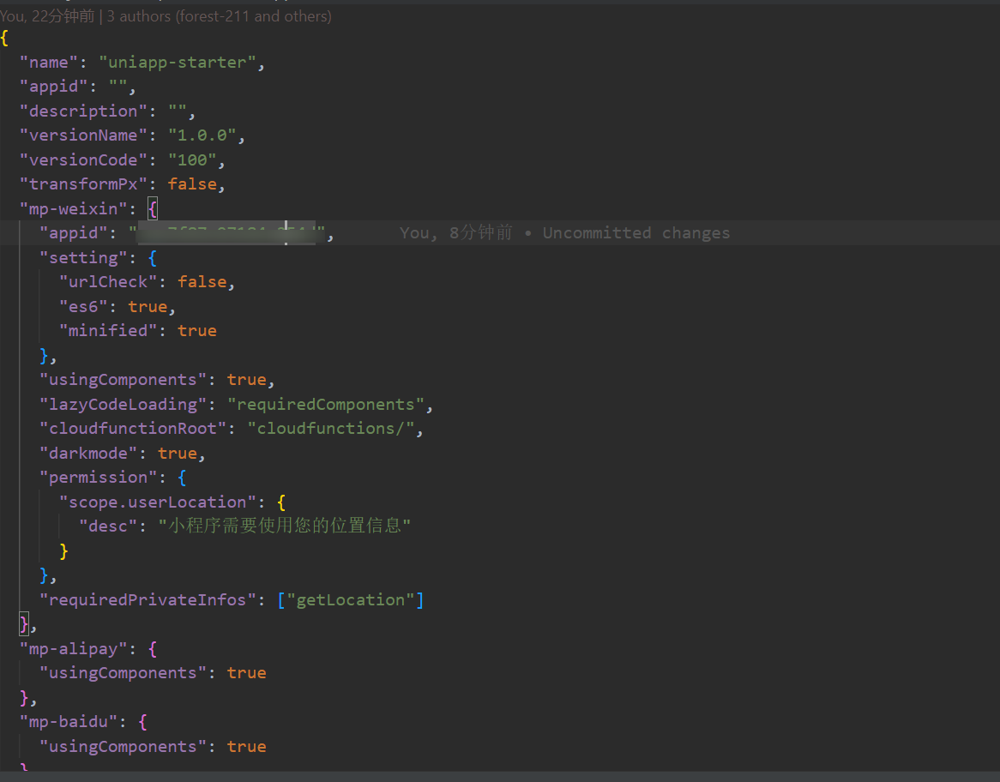
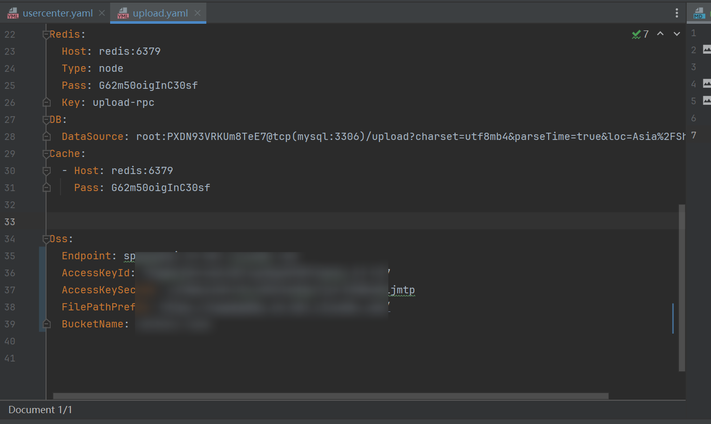

- 在本地将前后端项目跑起来之后，有的同学可能会遇到登录鉴权相关的问题，本篇主要解决这类问题
- 首先需要打开https://mp.weixin.qq.com/，
- 注意secret忘记了就要重新生成，
- 在前端项目需要在menifest.json中配置自己的appid
- 后端usercenter服务自己的appid和Secretmg_1.png)
- 然后需要配置oss，在upload服务的配置文件中，推荐可以使用七牛云，有免费的额度，配置如下
- https://blog.csdn.net/qq_45432276/article/details/131682581
-  将ak sk bk配置好，然后在前端项目中的menifest.json中配置自己的bucket

- 上传文件服务需要依赖upload数据库，确保该数据库存在且启动

- Notice服务想要启动，需要修改配置文件，WxMiniConf和WxMsgConf